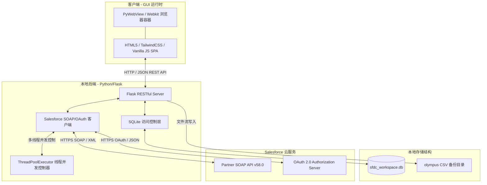
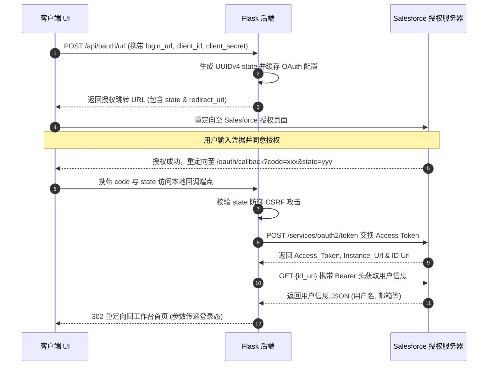
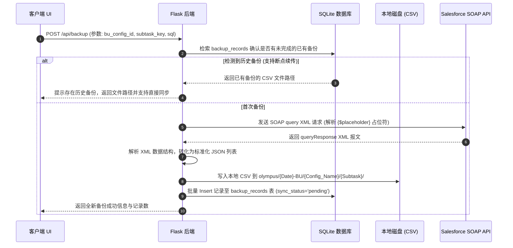
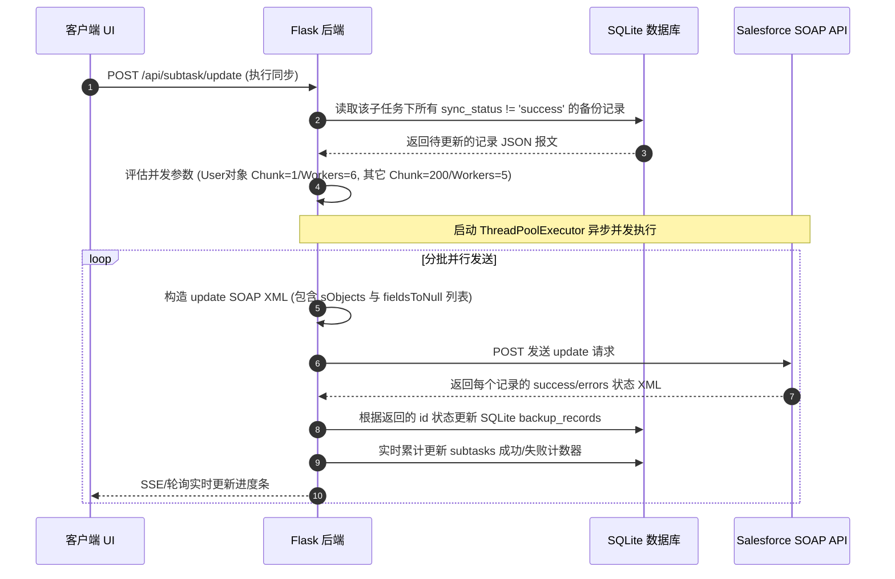

# BU省刷新工具 - 架构设计与技术实现文档

本规范文档旨在从方案实现层面详细阐述“BU省刷新工具”的整体架构设计、网络通信拓扑、系统接口规范、本地与远程存储设计以及关键的安全保障机制。本工具核心用于自动化、高可靠地执行 Salesforce 平台上的 BU（业务单元）省份及相关配置数据的本地备份与刷新操作。

---

## 1. 整体系统架构 (System Architecture)

“BU省刷新工具”采用轻量化的 **C/S (Client-Server)** 架构设计，在本地以单机应用形式运行，并可选通过 GUI 容器进行桌面化呈现。

### 1.1 架构拓扑图

以下为系统的整体模块拓扑与通信路径：

### 1.2 核心模块说明

1. **GUI 运行时 (Client)**
   - **前端 SPA**: 使用 HTML5、Tailwind CSS 及原生 JavaScript 编写的单页应用，提供任务配置交互、实时终端日志追踪、备份文件树浏览及 SQLite 数据库可视化管理等功能。
   - **PyWebView 容器**: 在打包发布（Frozen）模式下，使用 Python 的 `pywebview` 库拉起一个轻量化的 Webkit 窗口，屏蔽底层浏览器差异，提供本地桌面应用的交互体验。
2. **本地后端服务 (Flask)**
   - 基于 Python Flask 框架，运行在本地回环地址（`http://127.0.0.1:5000`）。
   - 负责解析前端 REST 请求，驱动 Salesforce 接口通信，并协调本地 SQLite 及 CSV 的读写。
3. **本地数据库 (SQLite)**
   - 使用本地轻量数据库 `sfdc_workspace.db`，实现以下元数据的持久化管理：
     - `bu_configs`: BU 刷新的主任务配置及进度状态。
     - `subtasks`: 具体刷新的对象子任务（如用户、客户、询价等）及其 SOQL 查询模板、当前状态。
     - `backup_records`: 每次备份到本地的具体 Salesforce 记录列表，用于追踪每一条记录的刷新状态（`pending`, `success`, `failed`）及错误日志，实现**断点续传**与**失败重试**。
     - `object_mappings`: 缓存字段与 Salesforce SObject 的 API Name 及 Label 映射关系，减少重复的 Describe 请求。
     - `terminal_logs`: 本地可视化控制台的持久化日志。
4. **Salesforce 适配器 (Salesforce Client)**
   - 核心通信基于 **Salesforce Partner SOAP API (v58.0)**，提供高兼容性的元数据描述、对象查询与批量数据更新服务。
   - 集成 OAuth 2.0 授权码流程，支持多环境登录。

---

## 2. 接口设计与网络通信 (Interfaces & Network)

### 2.1 认证与会话管理接口

工具支持三种登录验证方式：
1. **标准账号密码登录**: 通过 SOAP `login` 请求交换 `sessionId` 和 `serverUrl`。若开启双因子验证，可追加 `security_token`。
2. **Session 直登**: 允许用户直接录入已持有的有效 `sessionId` 和 `serverUrl`，后端调用 SOAP `getUserInfo` 进行鉴权与有效期校验。
3. **OAuth 2.0 授权登录**: 通过外部浏览器重定向交换 Authorization Code。

#### OAuth 2.0 认证时序图：

### 2.2 数据查询与备份接口

在数据备份阶段，工具执行动态 SOQL 查询，将数据保存至本地 CSV，同时落库 SQLite 备用。

#### SOQL 占位符动态解析机制
系统支持在 Salesforce 刷新的 SOQL 模板中写入如 `{$Province}` 等占位符。后端在解析时：
1. 从主任务配置记录中动态读取对应字段的值。
2. 针对 Salesforce 特殊的多选下拉列表（Multi-select Picklist，如以分号 `;` 分隔的数据），自动将其展开并格式化为 SOQL 兼容的 `IN` 查询语法（例如将 `A;B` 转换为 `'A','B'`）。

### 2.3 数据写入与更新接口 (数据刷新)

数据更新使用批量 SOAP `update` 接口，支持清除字段值（通过设置 `fieldsToNull`）。

#### 批量更新时序与并发设计：

---

## 3. 并发设计 (Concurrency Design)

Salesforce 平台在大批量更新数据时，容易因为锁竞争（Row Lock）或并发 API 限制导致操作失败（特别是 `User` 对象更新极其频繁地触及系统全局锁）。为此，本工具设计了**动态分片与线程池并发机制，以减少锁竞争的出现**：

### 3.1 差异化并发配置表

针对不同的 SObject 特性，工具采用完全不同的更新策略：

| SObject 类型 (子任务) | 单次 Batch 记录数 (Chunk Size) | 线程池最大并发数 (Max Workers) | 核心设计考虑 |
| :--- | :---: | :---: | :--- |
| **User (用户)** | `1` (逐条更新) | `6` | 规避极易发生的 Salesforce 全局用户行锁限制，高频小并发 |
| **其他常规对象** | `200` | `5` | 吞吐量优先，单次打包 200 条（Salesforce API 单次 Batch 上限），中度并发(不含：客户，询价，保有设备，需单独设置类似USER对象进行设置) |

### 3.2 数据库连接锁定规避
由于 Python SQLite 数据库在并发写操作时可能会发生 `database is locked` 异常，工具采用以下优化：
1. **网络与 I/O 隔离**: 在向 Salesforce 发起 SOAP HTTP 请求（长耗时网络 I/O）之前，**必须提前关闭（conn.close()）**当前的 SQLite 连接，严禁在持有数据库连接/事务的同时等待网络返回。
2. **细粒度连接**: 线程任务在拿到网络返回结果后，即开即闭地重新创建 SQLite 连接，写入数据并立刻 `commit()` 释放锁。

---

## 4. 安全设计与隐私防护 (Security & Privacy)

系统在处理敏感的 Salesforce 账户凭证、企业业务数据时，遵循“零持久化、本地优先”的安全策略。

### 4.1 凭证安全 (Zero Credentials Persistence)

- **密码与 Token 零落盘**: 用户输入的 Salesforce 登录密码、安全 Token 以及 OAuth 返回的 `access_token` **仅存储于本地 Flask 进程的运行内存或前端会话中**。本地 SQLite 数据库中绝不记录任何敏感密钥、密码或 Token 信息。
- **环境安全**: 所有的 API 请求均使用 HTTPS 协议，且只在用户本地回环地址（Loopback Address）及 Salesforce 官方终结点（`*.sfcrmproducts.cn`）之间流转。

### 4.2 输入防御 (Injection Prevention)

- **XML 实体转义**: 由于 Salesforce SOAP API 使用 XML 格式进行数据交换，后端在拼接账户名、密码及 SOQL 语句时，均通过 `html.escape()` 对敏感字符进行强转义，彻底消除了 XML 注入（XXE）的风险。
- **SQL 注入防御**: 在本地 SQLite 的可视化查询端点 `/api/db/table-data` 中，后端对传入的 `table` 参数执行了严格的**白名单过滤机制**（校验是否属于 `sqlite_master` 登记的合法物理表名），避免了恶意 SQL 拼接注入。

### 4.3 OAuth CSRF 防护
- 授权流程中引入了安全的 `state` 校验。跳转授权前，后端随机生成 `uuid.uuid4()` 作为 `state` 并保存在服务端映射表中。回调时比对 `state` 参数，确认无误后方可换取 Token，有效防止跨站请求伪造攻击。

### 4.4 数据物理隔离
- **数据本地化**: 所有备份生成的 CSV 文件与工作空间数据库均存储在用户本地设备上。
- **应用沙箱**: 在 PyInstaller 打包运行状态下，工具自动定位至用户的 Home 目录并在其中创建专属沙箱 `~/BU省刷新工具` 用以存放 `sfdc_workspace.db` 与 `olympus` 备份文件夹，避免对系统级目录进行非必要写入。
